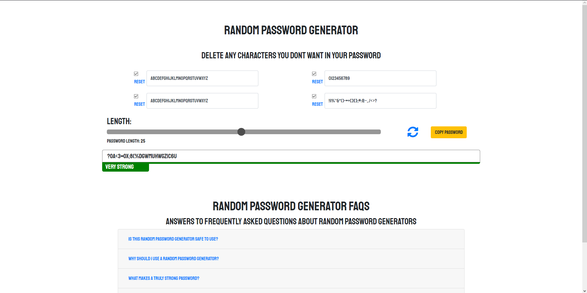
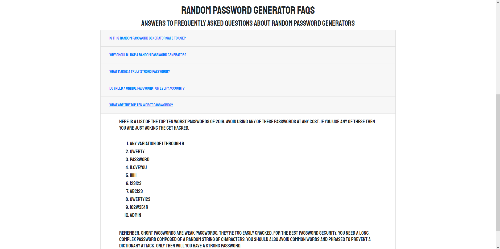

# Random password generator

Application that gives you a place to generate random passwords to stay safe. 

## [Try it yourself!](https://dawson-hamilton.github.io/random-password/)

### Generator



### FAQs



## Getting Started

These instructions will get you a copy of the project up and running on your local machine for 
development and testing purposes. They will also give an overview of some of the app's functionality. 

### Installing

Git clone the repository to your local machine:

HTTPS:
````
$ git clone https://github.com/dawson-hamilton/random-password.git
````
SSH:
````
$ git clone git@github.com:dawson-hamilton/random-password.git
````

You will then open the code by running this in the command line:
````
$ code .
````

Once the code is open all you have to do is right click on the index.HTML file and and click "Open in default browser" or use the keyboard shortcut. 

## Built With

* [CSS](https://developer.mozilla.org/en-US/docs/Web/CSS) - Front-End style library
* [JavaScript](https://developer.mozilla.org/en-US/docs/Web/javascript) - High level programming language
* [HTML](https://developer.mozilla.org/en-US/docs/Web/HTML) - Hypertext Markup Language
* [jQuery](https://jquery.com) - JavaScript library
* [bootstrap](https://getbootstrap.com) - CSS library

## Authors

See the list of [contributors](https://github.com/dawson-hamilton/random-password/graphs/contributors) who participated 
in this project along with individual commit history. 

## Planned updates

At the moment, the only thing that I would really like to add is a way for you to log in and you could then save your passwords for all your different websites and accouts. 
